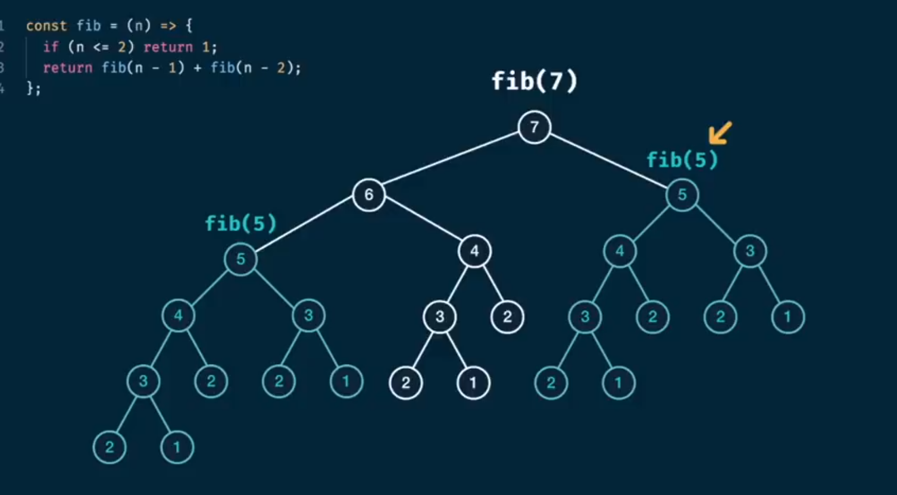
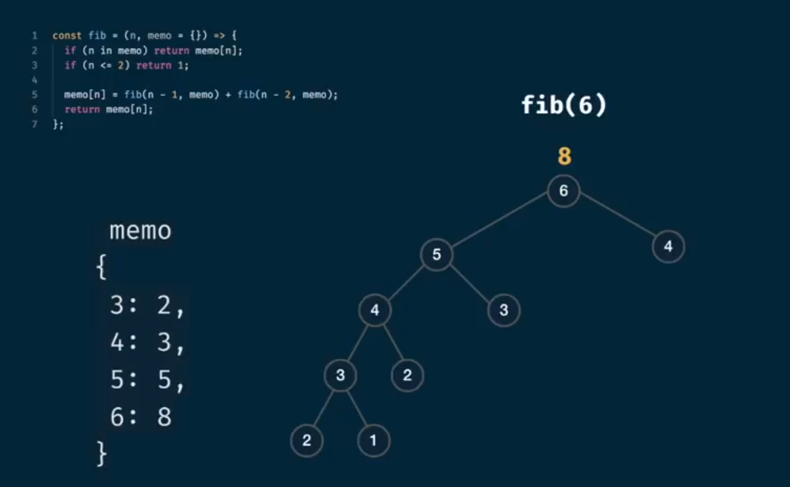
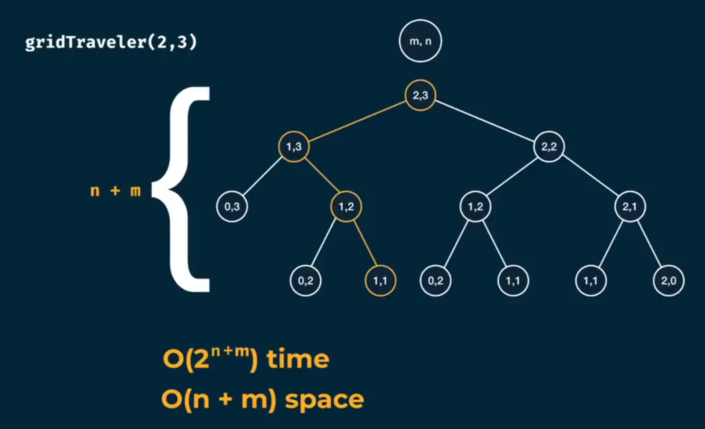
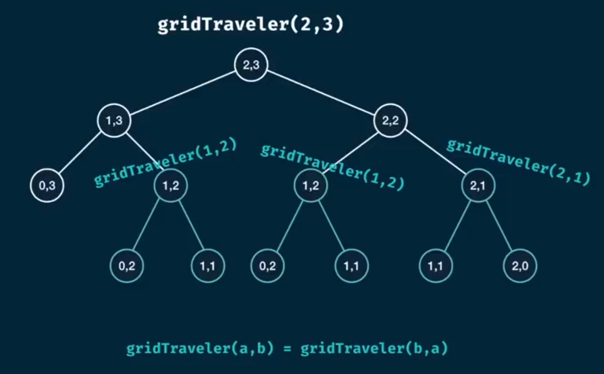

# Dynamic-Programming

-   What is it? - A programming technique where an algorithmic problem is first broken down into sub-problems, & sub-problems are use to find the optimal solution.

-   Memoization - store duplicate sub problems, so it can be reused when it occus again.

## Fib memoization [(view code)](Fib_memoization/fib.js)

```
const fib = (n) => {
    if (n <= 2) return 1;
    return fib(n - 1) + fib(n - 2);
};
```

above code will work fine for n like, 2, 3, 4. but if we consider big numbers like 50, 100, 200 this approach will take alot of time O(2^n). Take a look at the below tree structure.



-   here you can see that, fib(5) have been calculated twice. Which leads to higher time complexity.
-   Insted of calculating the fib(5) twice we can use the approach of **Memoization** to store the result of fib(5) and reuse the value on next call.

```
const newFib = (n, memo = {}) => {
    if(n in memo) return memo[n]; // calling
    if (n <= 2) return 1;
    memo[n] = newFib(n - 1, memo) + newFib(n - 2, memo); // storing
    return memo[n];
};

console.log(newFib(7));
console.log(newFib(50)); // won't take long time
```

-   In above mrthod it won't recalculate same n twice.
-   This will also decrease the time complexity to O(n).
    

## gridTraveler memoization [(view code)](gridTraveler_memoization/grid.js)

```
const gridTraveler = (m, n) => {
    if (m === 1 && n === 1) return 1;
    if (m === 0 || n === 0) return 0;
    return gridTraveler(m - 1, n) + gridTraveler(m, n - 1);
};
```

-   This will also result to high time complexity. O(2^(n+m))
-   The tree structure would be something like below.
    
-   we can use Memoization to reduce recalculating samething.
    
-   here the order won't matter. (n. m) same as (m, n).

```
const newGridTraveler = (m, n, memo = {}) => {
    const key = m + "," + n;
    if (key in memo) return memo[key];
    if (m === 1 && n === 1) return 1;
    if (m === 0 || n === 0) return 0;
    memo[key] = newGridTraveler(m - 1, n, memo) + newGridTraveler(m, n - 1, memo);
    return memo[key];
};
```

## Memoization recipe
